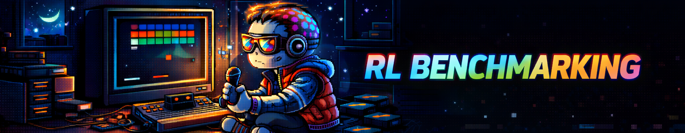
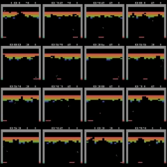

  

# RL Benchmarking Gym Bench
*Goal: Build a hackable RL engine from scratch then implement a ton of RL algorithms to bridge theoretical understanding to empirical performance.*

Ok, so you've read Sutton & Barto. *Cool*. But what is SOTA for Q-Learning? Policy Gradient methods? What about TD-MPC?

  

This is a super hackable RL environment for implementing RL algorithms on [Gymnasium environments](https://gymnasium.farama.org/index.html). It was designed to allow you to easily implement new algorithms and reuse modular components (e.g., sampling, buffers, neural architecures, visualization, various QoL). It was built to be fairly clean so anyone can start building on top of it.

🪲 *If you squash bugs I'll send you a kind message and accept your PR* 🪲

### Currently Completed
- ✅ Standard Gymnasium Envs + Atari Envs. All vectorized and deterministic
- ✅ DQN -> Rainbow (DDQN, Priority Experience Replay, Dueling Nets, Noisy Nets, N-Step TD, Distributional RL)
- ✅ Ability to save algorithms, videos, and training results following runs. Also integrated WandB (but built own visualizer that is better)
- ✅ Multi-seed testing with result aggregation (seeding makes a BIG difference...[great paper](https://arxiv.org/pdf/2108.13264) on this)
- ✅ All of this easily manipulable via config files

### Future Wishlist
- ➖ REINFORCE, REINFORCE++, RLOO, PPO, SAC (MuJoCo)
- ➖ TD-MPC, TD-MPC2 (MuJoCo)
- ➖ DreamerV3 (haven't considered how I want to implement, but on a simple environment could train a transition model vs. a full video-action model)

# Minimal Setup / Training
1) Install uv: https://docs.astral.sh/uv/
2) Create venv: `uv venv`
3) Activate:
	- Windows: `.venv\Scripts\activate`
	- macOS/Linux: `source .venv/bin/activate`
4) Install dependencies: `uv sync`
5) Run. First open `main.py` and point to a simple config (e.g., `configs/template.yaml`). Then run `python main.py`

If you want to use Weights&Biases, create a `.env` file in this project root and set 'WANDB_API_KEY=your_key'. Make sure to update in `config.py` your W&B project name (will default to *RL-Gym-Benchmarking*).

# Structure
Now here's the general structure.

### Main folders
First, the `main.py` file is what you commonly will update alongside your configs. Within `main.py`, you can choose to use the custom web-based visualizer and choose which yamls you want to train on (either specific yaml files or folders or both 🤠).

- `algorithms/`: Core RL algorithms. Each RL algorithm (e.g., DDQN, SAC) has it's own 'algorithm' file. You can see in `base.py` the structure of these files.
- `configs/`: yaml configs + loader. Look to `config.py` to understand the various arguments you can tune
- `dataclass/`: Define replay buffers (vanilla and PER) and various data containers we use to standardize data transfer
- `networks/`: model builders (MLP/CNN, dueling, distributional, noisy). The purpose is to make it easy to customize common backbones with arguments in the yaml. Would look to sample configs for various setups you can use
- `trainer/`: training loop, evaluation, and logging
- `saved_data/`: This is where your plots, algorithms, and videos will be saved to. There's a `process_plot.py` file that you can use to set which runs you want to aggregate. After running experiments, all you need to do is list which folders you want to aggregate and it will combine those for you.

### Abstraction Model
Consider the following abstractions that all plug together:
- `Environment`: This is vectorized and we call things like step and reset. Common RL gym environment setting.
- `Algorithm`: This holds networks, learning rate schedules, action samplers, and replay buffers. It has various methods like 'act', 'observe' and 'update' -- refer to the `base.py` file in the `algorithms/` folder to better understand this abstraction.
- `Buffers`: These have functions like 'add', 'sample' or 'update'. This codebase implements all buffers as storing entire trajectories in order (*we don't store until the trajectory is over*) so that we can seamlessly choose to do 1-step or arbitrary n-step for value estimation. 'update' is necessary for updating priorities in `Priority Experience Replay (PER)`.
- `Action Sampler`: This expects inputs as 'Batch x Actions' and can sample using various methods like *greedy*, *epsilon-greedy*, or *Boltzman (aka softmax w/ temperature)*.